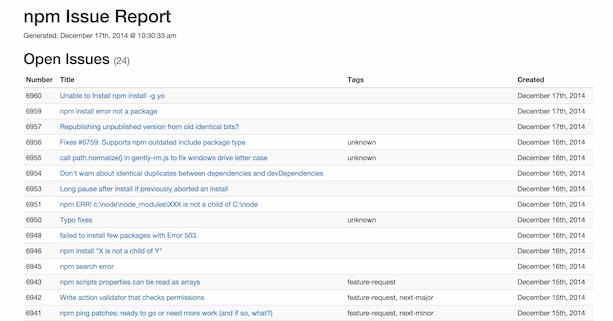

## Purpose

This simple little tool generates a static HTML report of issues for a Github repo. This is useful if you want to share
the status of issues with someone who doesn't have access to your repo, for example.

## Getting Started

1. Install `npm install -g github-issue-reports`
2. Run `github-issue-reports -o <owner> -r <repo> [-t <access token>]` (access token is required to access private repos)

[Creating an access token](https://help.github.com/articles/creating-an-access-token-for-command-line-use/)

## Sample Report

